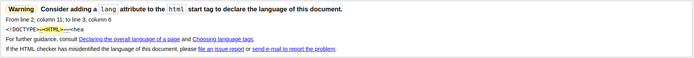

# Suggestive

A book suggestion tool geared toward social media content creators with a medium to large fanbase.
Fans can suggest books for the site owner to read and upvote other suggestions, the site owner can add books to their reading list and review them when finished.

Hosted on [Heroku](https://suggestive-dcd-project.herokuapp.com/),
Repository on [GitHub](https://github.com/Pattern-Projects/blender-ucd-project)

## License
The project is shared for use with the [GNU General Public License v3](LICENCE)

>   This program is free software: you can redistribute it and/or modify
    it under the terms of the GNU General Public License as published by
    the Free Software Foundation, either version 3 of the License, or
    (at your option) any later version.

## UX
 


### Users

Expected users of the website include content creators, creator fans, book readers, publishers, authors.

### User Stories

1. A content creator user recieves book suggestions, chooses which to read and gives reviews.
2. A creator fan user leaves suggestions on which books to read.
3. A reader user finds descriptive reviews of books they may like.
4. A publisher user evaluates the popularity of genres of target demographics.
5. An author user surveys star-rating reviews of their work.

### Design


- Colour Scheme consists of complementary colours with additional subtle accents
    - cheeky-pink:   `#E9AFAF`
    - cool-green:    `#AFE9AF`
    - neat-blue:    `#7EC8F2`
    - cheeky-pink buttons are seen by all users. cool-green and neat-blue buttons are seen by site owner.
    - active-gold:   `#FFF4CB`
    - text-grey:     `#3D3D3D`
    - text-white:    `#FFFFFF`
    - bg-grey:       `#F1EFEF`
- [Custom designed logo](documentation/logo.png) representing a smile on a face.
- Fonts chosem:     'Roboto', 'helvetica', sans-serif


### Mockups

- [Suggested Books](https://www.figma.com/file/bP38XbhERWhJPxhbrLVaxg/Book-suggester?node-id=1%3A2)
- [Suggest a Book](https://www.figma.com/file/bP38XbhERWhJPxhbrLVaxg/Book-suggester?node-id=1%3A26)
- [Reading List](https://www.figma.com/file/bP38XbhERWhJPxhbrLVaxg/Book-suggester?node-id=1%3A71)
- [Write Review](https://www.figma.com/file/bP38XbhERWhJPxhbrLVaxg/Book-suggester?node-id=2%3A2)
- [Reviews](https://www.figma.com/file/bP38XbhERWhJPxhbrLVaxg/Book-suggester?node-id=1%3A112)


## Features

Features planned, implemented and outlined for later development

### Planned Features

- Suggest a new book
    - Title
    - Author
    - Thumbnail Image
    - Similar existing book titles are suggested
- View existing suggestions
    - Favorite / Upvote books
- Owner can:
    - Add books to reading list
    - Remove books from suggestions
    - Review books on reading list, removing them from list
    - Make list public or private
    - Add blurb
- Sign Up and Login
- Page Redirects
- Home Page with list of users
- Flask Routing
- Jinja web templates
- Documentation - ReadMe File & Mockups
- Materialize - Framework
- Bootstrap - HTML, CSS Framework
    - Grid System - Columns and Rows
    - Cards
    - Icons
- Responsive design - Mobile First
- Defensive design
    - Double checking to ensure nothing breaks flow
- Accesibility
- Semantic HTML - nav, article, etc
- Colour Scheme
- Custom Logo
- Favicon
- Testing
- Git - Version Control System
- GitHub - Remote Repository
- Deployed - Hosted on Heroku

### Existing Features

- Suggest a new book
    - Title
    - Author
    - Thumbnail Image
- View existing suggestions
    - Favorite / Upvote books
- Owner can:
    - Add books to reading list
    - Remove books from suggestions
    - Review books on reading list
    - Removing them from list
    - Make list public or private
    - Add blurb
- Sign Up and Login
- Page redirects after login
- Home Page with list of users
- Flask Routing
- Jinja web templates
- Documentation - ReadMe File & Mockups
- Materialize - Framework
- Bootstrap - HTML, CSS Framework
    - Grid System - Columns and Rows
    - Cards
    - Icons
- Responsive design - Mobile First
- Accesibility
- Semantic HTML - nav, article, etc
- Colour Scheme
- Custom Logo
- Favicon
- Testing
- Git - Version Control System
- GitHub - Remote Repository
- Deployed - Hosted on Heroku

### Features Left to Implement

- Similar existing book titles - Fuzzy matching
- Extend beyond books - Movies, TV Shows, Live Performances, etc..
- Search By Book


## Technologies Used

In this section, you should mention all of the languages, frameworks, libraries, and any other tools that you have used to construct this project. For each, provide its name, a link to its official site and a short sentence of why it was used.
- [HTML](https://developer.mozilla.org/en-US/docs/Web/HTML)
    - HTML for strucutre
- [CSS](https://developer.mozilla.org/en-US/docs/Web/CSS)
    - CSS for Styling
- [Google Chrome](https://www.google.com/chrome/)
    - Used for browser and dev tools
- [Mozilla Firefox](https://www.mozilla.org/en-US/firefox/new)
    - Used for browser and dev tools
- [Figma](https://www.figma.com)
    - Development made use of **figma** for creating mockups.
- [Inkscape](https://inkscape.org)
    - Custom logo created using **Inkscape**.
- [Google](https://www.google.com/)
    - **Google** was used for research.
- [Bootstrap](https://getbootstrap.com/)
    - HTML and CSS Framework from **Bootstrap**
- [Materialize](https://materializecss.com/about.html)
    - Material Design by Google
    - [**JQuery**](https://jquery.com/) used by Materialize components
    - [**JavaScript**](https://www.w3schools.com/js/) used by Materialize components
- [Font Awesome](https://fontawesome.com/)
    - Favorites hearts icons recieved from **Font Awesome**
- [Python](https://www.python.org/)
    - Developed and run with python3
- [Flask](https://palletsprojects.com/p/flask/)
    - Microframework routing by Flask
- [Jinja](https://palletsprojects.com/p/jinja/)
    - Web template engine for use with Python
- [Flask-Pymongo](https://flask-pymongo.readthedocs.io/en/latest/)
    - Connecting to MongoDB with Python
- [dnspython](https://pypi.org/project/dnspython/)
    - DNS toolkit for Python
- [hashlib](https://docs.python.org/2/library/hashlib.html)
    - The **hashlib** library was used for hashing stored passwords
- [cProfile](https://docs.python.org/2/library/profile.html#module-cProfile)
    - cProfile was used for effeciency testing the software
- [Mongodb Cloud](https://cloud.mongodb.com)
    - Cloud storage with **MongoDB** 
- [Heroku](https://www.heroku.com/)
    - App hosted on **Heroku**
- [Cloud9](https://c9.io/)
    - This project was built using the **Cloud9** IDE
- [Git](https://git-scm.com/)
    - **Git** used for Version Control
- [GitHub](https://github.com/)
    - Repository hosted on **GitHub**
- [Google Search Console](https://search.google.com)
    - SEO and usage analytics from **Google Search Console**
- [PageSpeed Insights](https://developers.google.com/speed/pagespeed/insights/)
    - Dektop and Mobile page performance testing from **PSI**    

## Testing

The site was tested through a number of means.

### User Stories
The user stories created during the design phase were inacted:
1. A content creator user wants to create a space in which to recieve book suggestions
    - The user visits the login page
    - They input a unique username and a password 
    - They are redirected to their newly created list info page
    - They set their list to public and add a blurb
    - They can now recieve book suggestions
2. A creator fan users wants to make suggestions on which books the creator should read
    - Visiting the login page they input a unique username and password creating a newaccount
    - They visit the creators list info page
    - Clicking the 'Suggest a Book' button they can input a book suggestion
    - They enter a Title, author and a url for the book thumbnail
    - Clicking 'Suggest' The book is now added to the list of suggestions
3. An avid reader user looks for reviews of books they may like
    - Having learned a creator has completed a book they may like they visit the creators list through their personal url link
    - They open the reviews page
    - Finding the book the can read the creators review of the book and a star rating
4. A publisher user wants to gauge the popularity of certain genres among demographics
    - Visiting the Suggestive home page they have access to public suggestion lists
    - Reading through these they can find reviews, ratings and popularity of genres
5. An author user surveys star response to their work
    - Searching their book on google the user finds a link to it on Suggestive
    - Opening the page they can read a written review as well as a star rating

### HTML Check



Using W3's [Nu HTML Checker](https://validator.w3.org/nu/) the website was checked for structure and syntax validation.

Issues returned were of the following type:
- Warning: Consider adding a lang attribute to the html start tag to declare the language of this document.
    - This issue is solved by adding ```<html lang="en">``` to the top of base.html
- Error: Missing space before doctype name.
- Error: Nameless doctype.

Solving the remaining errors and warnings is outside of the current scope of the project

### CSS Validation

The websites CSS was tested with W3's [Jigsaw](https://jigsaw.w3.org/css-validator/) CSS Validation Service. 
Many Errors and warnings were returned. These originate at the Bootstrap CSS files. 
Fixing these issues is outside the scope of the project.

### Performance

Using Google's [PageSpeed Insights](https://developers.google.com/speed/pagespeed/insights/) the website was tested for network performance.
The results were:
- [Desktop:  100%](documentation/desktop-performance.png)
- [Mobile:   96%](documentation/mobile-performance.png)

Suggestions provided to improve mobile performance include:
- Eliminate render-blocking resources
- Enable text compression

[cProfile](https://docs.python.org/2/library/profile.html#module-cProfile) was used to test for efficiency bottlenecks in the app.

### Resolution

The website was viewed at various resolutions using [InfoByIp Resolution Test](http://www.infobyip.com/testwebsiteresolution.php).
The website looks well at high and medium resolutions. There is some overlay of logo and menu button at very smll screens.

### Bugs


- User reported bug: 
    - Page extends with each reload, pushing buttons furthere and further down the page.
    - Attempts to recreate the issue were unsuccessful.


- Some overlap of logo and button on very small screens.

- Reload after favorite/unfavorite seems unncessary.
    - The page update could be achieved using javascript without the need to reload page


## Deployment

The project is deployed to Heroku, making use of Mongodb Cloud for database storage. Users can use the site by visiting: https://suggestive-dcd-project.herokuapp.com/

The project can also be deployed by anyone with some technical know how. Here are the steps:
- Visit https://github.com/Pattern-Projects/suggestive-dcd-project and get a [clone link](https://github.com/Pattern-Projects/suggestive-dcd-project.git)
- Sign in to AWS Cloud9 and create a new project, name it suggestive
- Sign in to mongodb.com and create a new database, create two collections:
    - users
    - items
- Using the connect feature copy the connection srv down for later
- Open Heroku and create a new project, name it suggestive
- Add the following config vars to your Heroku project:
    - IP    0.0.0.0
    - PORT  8000
    - MONGO_URI     This is the srv copied from Mongodb
    - SECRET_KEY    Create one by opening a terminal and typing: 'openssl rand -base64 32 | colrm 33'
- Set a temporary open whitelist on mongo so that anywhere can connect to it
- Open a new terminal in cloud9 and enter: 'git clone https://github.com/Pattern-Projects/suggestive-dcd-project.git'
- Install dependencies with: 'pip3 install requirements.txt'
- When complete run python3 app.py to run it in cloud9 and view it with Preview > Preview Running Application
- Take this as a troubleshooting moment. If anything is not working, fix it now.
- Find the IP address of your heroku project and whitelist it permanently on Mongo
- Create a new github repo and push the project to it
- Connect heroku to the github repo
- Turn on automatic deploys and click deploy now
- On the top of the heroku project page, click 'Open app'

### Tips

- Give it a few moments after deplying to start running
- It will take time to run the page again after a period of inactivity
- SEO and visitor statistics are available by:
    - Create a Google Search Console Account
    - replace the meta tag on line 23 of base.html with your own

## Credits

### Media

- Default Book Thumbnail was sourced from [RGB Stock](https://www.rgbstock.com/photo/nEI3N1c/Vintage+Paper)
Book thumbnails attached to entries are sourced by users from all over the web. 
Suggestive project does not claim any ownership of the images used.

### Acknowledgements

Thank you to the following for inspiration, motivation and the direction I needed:

- Seun Owonikoko    @seun_mentor

- Sean Murphy       @Seán_alumni
- Anna Greave       @Anna_G
- Edel O' Sullivan  @Edel O' Sullivan
- Shane Muirhead    @Shane Muirhead
- Sunny Hebbar      @hebs97
- Heather Olcot     @heather
- Simen Daehlin     @Eventyret_mentor
- Sonya             @Sonya_alumni
- Selina Erhabor    @Sel_lead
- Elias O. Prado    @Oliveira

- Pawel Gnas
- Huilan Wang

- Anyone I may have missed

- Code Institute