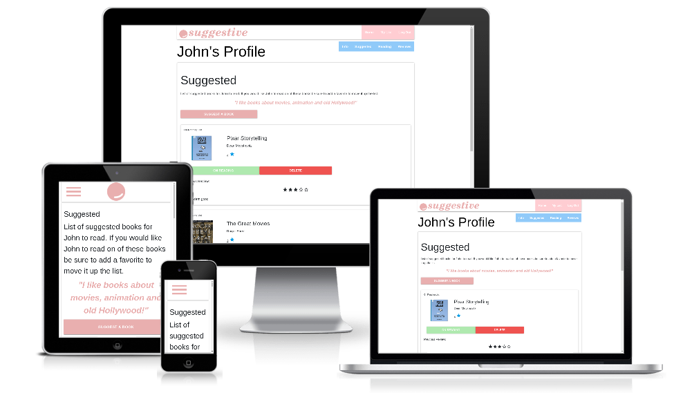

# Suggestive

A book suggestion tool geared toward social media content creators with a medium to large fanbase.
Fans can suggest books for the site owner to read and upvote other suggestions, the site owner can add books to their reading list and review them when finished.

## UX
 

### Users
Expected users of the website include content creators, creator fans, book readers, publishers, authors.

### User Stories
1. A content creator user recieves book suggestions, chooses which to read and gives reviews.
2. A creator fan user leaves suggestions on which books to read.
3. A reader user finds descriptive reviews of books they may like.
4. A publisher user evaluates the popularity of genres of target demographics.
5. An author user surveys star-rating reviews of their work.

### Design

- Colour Scheme consists of complementary colours with additional subtle accents
    - cheeky-pink:   `#E9AFAF`
    - cool-green:    `#AFE9AF`
    - light-blue:    `#7EC8F2`
    - cheeky-pink buttons are seen by all users. cool-green and light-blue buttons are seen by site owner.
    - active-gold:   `#FFF4CB`
    - text-grey:     `#3D3D3D`
    - text-white:    `#FFFFFF`
    - star-gold:     `#F1B929`
    - star-grey:     `#C4C4C4`
    - bg-grey:       `#F1EFEF`
- [Custom designed logo](documentation/logo.png) representing a smile on a face.

### Mockups
- [Suggested Books](https://www.figma.com/file/bP38XbhERWhJPxhbrLVaxg/Book-suggester?node-id=1%3A2)
- [Suggest a Book](https://www.figma.com/file/bP38XbhERWhJPxhbrLVaxg/Book-suggester?node-id=1%3A26)
- [Reading List](https://www.figma.com/file/bP38XbhERWhJPxhbrLVaxg/Book-suggester?node-id=1%3A71)
- [Write Review](https://www.figma.com/file/bP38XbhERWhJPxhbrLVaxg/Book-suggester?node-id=2%3A2)
- [Reviews](https://www.figma.com/file/bP38XbhERWhJPxhbrLVaxg/Book-suggester?node-id=1%3A112)

## Features
Features planned, implemented and outlined for later development

### Planned Features
- Suggest a new book
    - Title
    - Author
    - Similar existing book titles are suggested
- View existing suggestions
    - Favorite / Upvote books
- Owner can add books to reading list
- Owner can remove books from suggestions
- Owner can review books on reading list, removing them from list
- Sign Up and Login
- Flask Routing
- Jinja web templates
- Documentation - ReadMe File & Mockups
- Bootstrap - HTML, CSS Framework
    - Grid System - Columns and Rows
    - Cards
    - Icons
- Responsive design - Mobile First
- Accesibility
- Semantic HTML - nav, article, etc
- Colour Scheme
- Custom Logo
- Favicon
- Testing
- Git - Version Control System
- GitHub - Remote Repository
- Deployed - Hosted on Heroku
 
### Existing Features
- Feature 1 - allows users X to achieve Y, by having them fill out Z
- ...

For some/all of your features, you may choose to reference the specific project files that implement them, although this is entirely optional.

### Features Left to Implement
- Another feature idea

## Technologies Used

In this section, you should mention all of the languages, frameworks, libraries, and any other tools that you have used to construct this project. For each, provide its name, a link to its official site and a short sentence of why it was used.
- [Python](https://www.python.org/)
- [Flask](https://palletsprojects.com/p/flask/)
- [Jinja](https://palletsprojects.com/p/jinja/)
- [Flask-Pymongo](https://flask-pymongo.readthedocs.io/en/latest/)
- [dnspython](https://pypi.org/project/dnspython/)
- [JQuery](https://jquery.com)
    - The project uses **JQuery** to simplify DOM manipulation.
- [Materialize](https://materializecss.com/about.html)
    - Material Design by Google

## Testing

In this section, you need to convince the assessor that you have conducted enough testing to legitimately believe that the site works well. Essentially, in this part you will want to go over all of your user stories from the UX section and ensure that they all work as intended, with the project providing an easy and straightforward way for the users to achieve their goals.

Whenever it is feasible, prefer to automate your tests, and if you've done so, provide a brief explanation of your approach, link to the test file(s) and explain how to run them.

For any scenarios that have not been automated, test the user stories manually and provide as much detail as is relevant. A particularly useful form for describing your testing process is via scenarios, such as:

1. Contact form:
    1. Go to the "Contact Us" page
    2. Try to submit the empty form and verify that an error message about the required fields appears
    3. Try to submit the form with an invalid email address and verify that a relevant error message appears
    4. Try to submit the form with all inputs valid and verify that a success message appears.

In addition, you should mention in this section how your project looks and works on different browsers and screen sizes.

You should also mention in this section any interesting bugs or problems you discovered during your testing, even if you haven't addressed them yet.

If this section grows too long, you may want to split it off into a separate file and link to it from here.

## Deployment

This section should describe the process you went through to deploy the project to a hosting platform (e.g. GitHub Pages or Heroku).

In particular, you should provide all details of the differences between the deployed version and the development version, if any, including:
- Different values for environment variables (Heroku Config Vars)?
- Different configuration files?
- Separate git branch?
- White list on MongoDB
 

In addition, if it is not obvious, you should also describe how to run your code locally.

- git pull
- mongodb
- heroku
- 

## Credits

### Content
- The text for section Y was copied from the [Wikipedia article Z](https://en.wikipedia.org/wiki/Z)

### Media
- Default Book Thumbnail was sourced from [REB Stock](https://www.rgbstock.com/photo/nEI3N1c/Vintage+Paper)
Book thumbnails attached to entries are sourced by users from all over the web. 
Suggestive project does not claim any ownership of the images used.

### Acknowledgements
Thank you to the following for inspiration, motivation and the direction I needed:

- Seun Owonikoko    @seun_mentor

- Sean Murphy       @Seán_alumni
- Anna Greave       @Anna_G
- Shane Muirhead    @Shane Muirhead
- Sunny Hebbar      @hebs97
- Heather Olcot     @heather
- Simen Daehlin     @Eventyret_mentor
- Sonya             @Sonya_alumni
- Selina Erhabor    @Sel_lead

- Code Institute